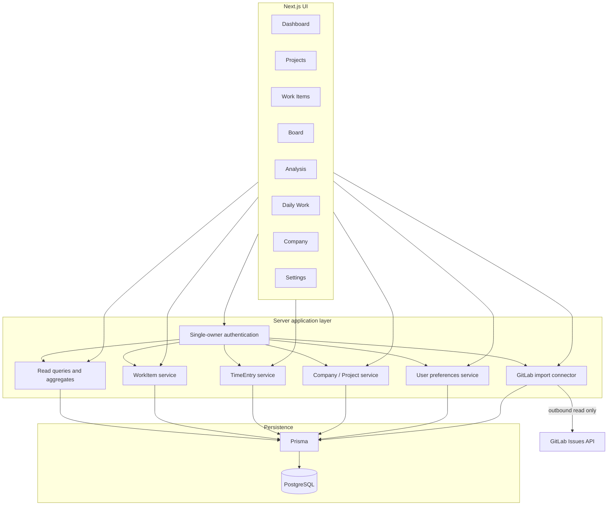
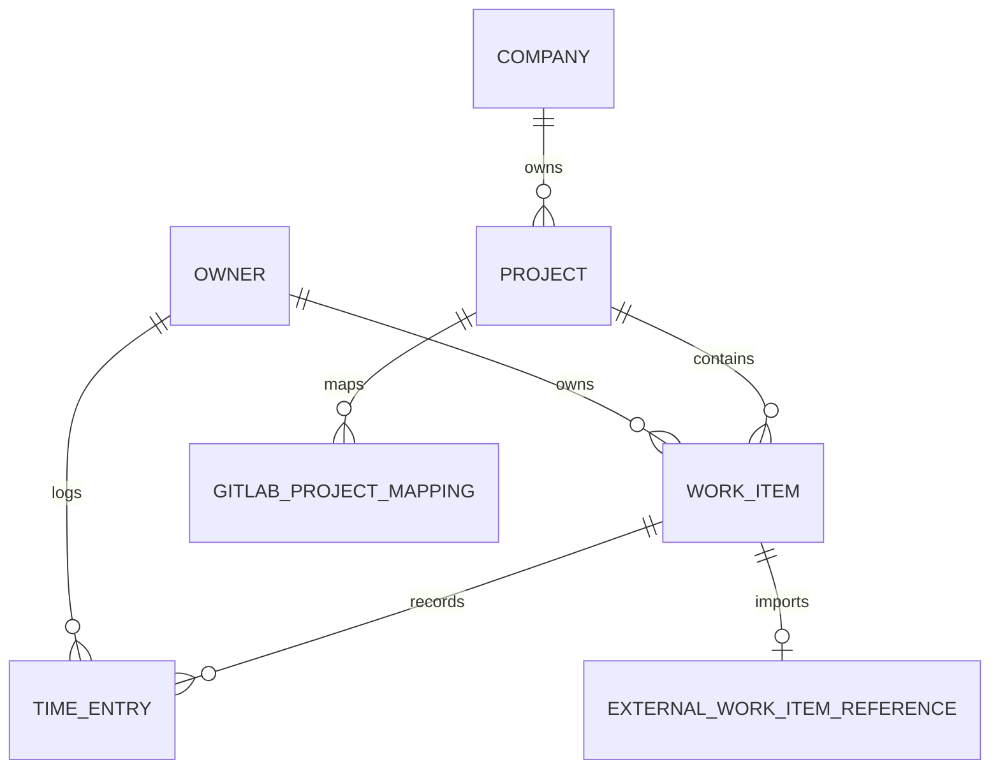

# ARCHITECTURE (EV)

> **Owner decision 2026-09-29:** canonical path เปลี่ยนเป็น `Company → Project → WorkItem → TimeEntry`; ไม่มี Customer registry. ดู [Company → Project decision](./COMPANY_PROJECT_DECISION.md) ก่อนใช้ target เก่าในเอกสารนี้.

| รายการ | ค่า |
| --- | --- |
| ฉบับ | EV — Enhanced Version |
| สถานะ | สถาปัตยกรรมเป้าหมายสำหรับระบบชุดปัจจุบัน |
| ภาษาหลัก | ไทย; system terms คงภาษาอังกฤษ |
| ข้อกำหนด | [Shared Data Model](./SHARED_DATA_MODEL.md) · [Customer/Project Migration Contract](./CUSTOMER_PROJECT_MIGRATION.md) · [GitLab Issue Import Contract](./GITLAB_ISSUE_IMPORT.md) · [ENGINEERING_SPEC.md](./ENGINEERING_SPEC.md) · [API.md](./API.md) · [DATABASE.md](./DATABASE.md) |

> ภาพ As-Is ด้านล่างอิง repository ที่ตรวจพบ ณ วันที่ 2026-09-27; ส่วน Target เป็นแนวทางระบบที่เมนูทั้งหมดอ่านข้อมูลจริงชุดเดียวกัน

## 1. Architectural goals

ความสัมพันธ์และ source of truth ของ business records ให้ยึด [Shared Data Model](./SHARED_DATA_MODEL.md)

- คงเป็น modular monolith บน Next.js App Router, Next.js Route Handlers, Prisma และ PostgreSQL
- ให้ `WorkItem` และ `TimeEntry` เป็น operational records กลาง ไม่แยกสำเนางาน/เวลารายเมนู
- ให้หน้า read model/aggregate เป็น query ที่คำนวณจาก record จริง ไม่ใช้ mock arrays หรือ state ที่ไม่ persist
- ผูก Project กับ Company ผ่าน `Project.companyId`; รองรับหลาย Companies และใช้ Dhas กับ Projects เดิม. Company/Project rollout และ Production validation อยู่ใน [Company/Project implementation](./COMPANY_PROJECT_IMPLEMENTATION.md)
- รวม validation, enum mapping, project/work-item consistency และ authorization ไว้ฝั่ง server

## 2. As-Is architecture

```mermaid
flowchart LR
  U[Browser] --> N[Next.js App Router UI]
  N -->|fetch| RH[Route Handlers]
  N -->|server Prisma query| P[Prisma Client]
  RH --> P
  P --> DB[(PostgreSQL)]
  RH --> WI[/api/work-items]
  RH --> WL[/api/work-logs]
  RH --> PR[/api/projects]
  RH --> US[/api/users]
```

ข้อสังเกต As-Is:

- Dashboard, Board, Analysis ใช้ข้อมูลฝังใน component; ไม่ผ่าน API หรือ DB
- Work Items และ Daily Work ใช้ API และ persistent database records
- Projects page ดึงข้อมูลผ่าน Prisma ฝั่ง server; Project API มี list/create และ detail read/update/delete
- Company page อ่านบางข้อมูลผ่าน Prisma ฝั่ง server; ยังไม่พบ API สำหรับ Company/Customer persistence; ปุ่มสมาชิกปัจจุบันเป็น UI ที่ไม่ตรงกับ product scope แบบ single-owner
- Settings เป็น form UI; ยังไม่พบ endpoint สำหรับบันทึก
- Baseline 2026-09-27 ไม่มี owner gate หรือ Project summary; #17 เพิ่ม owner gate/resolver และ #18 เพิ่ม Company relation/API กับ Project summary ใน source โดยยังไม่ยืนยัน database rollout

## 3. Target logical architecture



Logical services are modules inside the existing Next.js server, not separately deployed microservices. Route Handlers expose the HTTP contract; shared service functions own validation and business rules. Server Components may call the same query/service modules directly when they do not need an HTTP round trip.

## 4. Data ownership and read/write paths



`OWNER` ใน target diagram map กับ `User` record เดียวของเจ้าของใน schema ปัจจุบัน; `ProjectMember` เป็น legacy relation และไม่ใช่ส่วนของ target workflow แบบ single-owner

| User action | Write owner | Read surfaces |
| --- | --- | --- |
| Create/update/change Work Item status | WorkItem service → `WorkItem` | Work Items, Board, Dashboard, Projects, Analysis |
| Log/edit/delete hours | TimeEntry service → `TimeEntry` linked to WorkItem | Daily Work, Work Item details, Projects, Dashboard, Analysis |
| Set a Project's Company | Company/Project service → `Project.companyId` | Projects, Dashboard, filters, Analysis |
| Edit Company data | Company service → `Company`, `Project.companyId` | Company, Projects, Dashboard, Analysis |
| Change owner preferences | Settings service → owner preference store (target schema decision) | Settings and shared UI |

GitLab sync uses a separate import path into `WorkItem` plus an external reference; the linked PMS Project supplies its Company context. GitLab owns imported title, description, status, mapped types and due date; the PMS owner retains functional role, priority, work date, assignee and Daily Work. Removing a project mapping must not delete imported WorkItems or TimeEntries. The full identity, pagination, partial-result and retry contract is in [GitLab Issue Import Contract](./GITLAB_ISSUE_IMPORT.md). No menu owns a private copy of a Work Item or its status. Dashboard and Analysis are projections (query results), not write models. If one mutation changes related rows, commit the change transactionally and refresh/invalidate the affected query results.

## 5. Component boundaries

| Layer | Responsibility | Must not own |
| --- | --- | --- |
| UI route/page | Filter input, rendering, loading/empty/error state, navigation | Business truth or fabricated KPI values |
| API Route Handler | HTTP parsing, status codes, authenticated principal, request/response shape | Duplicate domain rules |
| Application service | Input validation, authZ, cross-entity checks, transactions, mutation result | Presentation-only formatting |
| Read query module | Shared list/detail/aggregate query definitions and filters | Independent data persistence |
| Prisma | Typed persistence mapping and relations | HTTP/view state |
| PostgreSQL | Persistent data, constraints, indexes, transactions | Derived duplicated metrics |

### 5.1 Shared presentation behavior

ทุกเมนูใช้ design tokens และ shared UI components เพื่อให้ typography, spacing, colors และ visual hierarchy สม่ำเสมอ โดยใช้ **Neumorphism เป็น visual language กลาง**: surface อาจใช้ raised/inset effect และ soft shadow อย่างพอดีเพื่อแยกชั้นข้อมูล; ใช้ theme-aware tokens แทนการกำหนดสีหรือเงาตายตัว และปรับเงาให้เหมาะกับ light, dark และ special-dark ที่มีอยู่ ไม่เพิ่ม theme mode หรือ preference แยกสำหรับ Neumorphism

Neumorphism ใช้กับ surface และ component ที่ช่วยสื่อ hierarchy เท่านั้น ไม่ใส่เงาซ้ำทุก element หรือทำให้ข้อมูลหนาแน่นอ่านยาก; คง typography, border/divider, icon, semantic status color และ affordance ที่ชัดเจนไว้ เงาและสีพื้นผิวใช้แทนข้อความ, contrast, selected/error state, keyboard focus indicator หรือ focus ring ไม่ได้ ทุกเมนูต้องใช้กติกานี้ผ่าน shared tokens/components เดียวกัน

ชั้น Presentation ต้องปรับ layout ตามโทรศัพท์ แท็บเล็ต และโน้ตบุ๊ก; การเลื่อนแนวนอนอนุญาตเฉพาะภายใน component ที่จำเป็น เช่น Board หรือ tabs ไม่ใช่ทั้งหน้า

Dashboard และ Analysis charts ต้องยืดตาม parent container (เช่นกำหนด `min-width: 0` ใน flex/grid context) และวางแกน, legend, tooltip และ label ให้อยู่ภายในกรอบ chart component ใช้ CSS transition หรือ animation utilities ที่มีอยู่สำหรับ hover/focus, dialog/dropdown, loading และ Board drag โดยประมาณ 120–180 ms สำหรับ hover/focus และ 160–220 ms สำหรับ dialog/dropdown ไม่เพิ่ม dependency โดยไม่จำเป็น และต้องรองรับ keyboard focus กับ `prefers-reduced-motion`; motion ต้องไม่หน่วง mutation หรือทำให้ layout shift

## 6. Key architecture decisions

1. **Modular monolith:** match the existing deployable unit; introduce a service boundary in code rather than a new service fleet.
2. **One WorkItem record:** Board status and list status are views of the same enum-backed field.
3. **Daily Work belongs to a Work Item:** a time entry must not become an unrelated free-floating task; derive Project context from that Work Item or enforce consistency on the server and database.
4. **Company is a required Project relation:** multiple Companies are allowed; every Project has one Company, and existing Projects are assigned to Dhas. The Production rollout completed with a staged nullable FK/backfill/validation/NOT NULL sequence.
5. **Analytics are query-time aggregates initially:** use PostgreSQL aggregates/indexes; add caching/materialized views only after measurement and with an invalidation strategy.
6. **One date/time policy:** `Asia/Bangkok` is the system, application, and database-session default in every environment. All date/time values persisted by the application use Bangkok calendar/wall-clock semantics; do not convert stored timestamps to UTC. Convert inputs and outputs explicitly using `Asia/Bangkok`, independent of browser/device timezone. Settings shows the fixed system timezone and cannot change persistence or business-date calculations.
7. **Security boundary:** browser-provided identity is not trusted; authenticate the single owner and resolve the owner record server-side. Developer/Infra/SA are WorkItem functional roles, not authorization roles. Add multi-user authorization only if product scope changes.
8. **GitLab integration:** keep the connector inside the modular monolith; import GitLab Issues into existing WorkItems in one direction only. Start with owner-triggered manual sync, explicit GitLab Project → PMS Project mapping, external identity for deduplication, and server-only token storage. Follow [GitLab Issue Import Contract](./GITLAB_ISSUE_IMPORT.md); do not deploy a separate service for this integration.
9. **Shared visual language:** apply Neumorphism across all eight menus through shared theme-aware tokens/components; preserve existing light/dark/special-dark modes and accessibility contrast/focus requirements. This is a system design treatment, not a separate user-selectable theme.

## 7. Consistency and failure handling

- Project ID on a Daily Work request must agree with the selected Work Item's project ID; reject mismatch with 400/409 and do not create a row.
- WorkItem mutation success returns canonical serialized values; UI updates only after success or rolls back optimistic state on failure.
- Aggregate endpoints use the same statuses, date anchoring, timezone, and cancellation policy as the pages displaying the corresponding rows.
- Deleting Project/owner identity follows explicit retention behavior; avoid relying on implicit cascade for records users consider business history.
- Database unavailable: health endpoint returns 503; page/API returns actionable error state without exposing secrets or stack traces.
- GitLab unavailable/rate-limited: report sync failure or partial result, preserve committed records, and allow a safe retry; unique external identity makes retry idempotent under the [GitLab Issue Import Contract](./GITLAB_ISSUE_IMPORT.md).

## 8. Runtime and deployment

```text
Browser → Next.js standalone container → Prisma → PostgreSQL 16 container/host
                                     ↘ /api/health
```

Development, UAT and production use Docker Compose files already present. The shared compose defines PostgreSQL and a one-shot migrations service. Application images are built with Next.js standalone output; migration container performs guarded `prisma db push` and optional seed. See [DEPLOYMENT.md](./DEPLOYMENT.md) for ports, configuration and operation commands.

## 9. Decisions still open

- Production Company/Project mapping and evidence are recorded in [Company/Project implementation](./COMPANY_PROJECT_IMPLEMENTATION.md); other environments must complete their own verified backup and rollout gates before schema changes.
- Owner authentication method and whether this single-owner installation sits behind an additional private network/access gate
- Company multiplicity is decided for #18: the product supports multiple Companies, with one Company required per Project
- Whether to add WorkItem status history and a dedicated `completedAt`
- User preference persistence schema and whether Security settings are in current product scope
- Retention/archive implementation for deleted Projects, Users, WorkItems and TimeEntries; until approved, reject deletion that would cascade into business history
- GitLab instance/token provisioning, Project mapping, field/label mapping, conflict policy, and whether remote time tracking should create Daily Work entries


## Runtime security ที่ implement ใน #15

สถานะเพิ่มเติม ณ 2026-09-28: owner gate ตรวจ HTTP Basic ก่อนส่ง request ไป Next.js แบบ loopback; gate แทนที่ internal proof ที่ browser ส่งมา แล้ว middleware ตรวจ proof และส่ง authenticated marker ให้ Route Handler. `getOwner()` ตรวจ marker และเลือก `User` เพียงหนึ่งแถว; หากไม่มีหรือมีหลายแถวจะ fail closed. หน้าและ API ผ่าน middleware เดียวกัน ยกเว้น `GET /api/health`. ไม่มี permission matrix หรือ session table. ดู [Runtime Security](./RUNTIME_SECURITY.md).

## Database operations ที่ implement ใน #16

เครื่องมือ backup/isolated restore/staged validation/health และ retention อยู่ใน [Database Rollout](./DATABASE_ROLLOUT.md). #16 เตรียมเครื่องมือ; #18 rollout Company/Project ใน Production แล้ว. #20 เพิ่ม GitLab schema source และ APIs ใน repository แต่ยังไม่ apply schema กับ environment; ต้องผ่าน runbook ของ environment เป้าหมายก่อน sync จริง.

## Work Item management ที่ implement ใน #19

Route Handlers ใช้ shared WorkItem input parser สำหรับ create/update และตรวจ owner กับ Project ฝั่ง server. Work Item detail คืน Company ผ่าน Project และเฉพาะ Daily Work ของ owner ที่เชื่อมกับ WorkItem เดียวกัน. Import ประมวลผลแต่ละแถวแยกกันและไม่เขียนทับ ID ซ้ำ; การลบ WorkItem ที่มี TimeEntry ปฏิเสธด้วย `409 HISTORY_CONFLICT`, ขณะที่ Prisma `Restrict` ป้องกัน race ที่จะทำให้ history หลุดความสัมพันธ์. WorkItem date fields เป็น PostgreSQL `DATE`; timestamp fields เป็น Bangkok local wall-clock. Schema source เปลี่ยนแล้วแต่ยังไม่มี database rollout ในงานนี้.

## GitLab Issue import ที่ implement ใน #20

Owner-only mapping/status/sync routes อยู่ใน `app/api/integrations/gitlab/`; `lib/gitlab-issue-import.ts` ทำ server-only GET/pagination และ per-Issue serializable identity upsert. External identity แยกจาก mapping เพื่อให้ unmap เก็บ reference และประวัติ. First sync ต้องได้รับ explicit owner approval. GitLab เขียนได้เฉพาะ title, description, status, mapped types, dueDate และ external metadata; PMS owner/role/priority/workDate/TimeEntry คงเดิม. Tests ใช้ mock เท่านั้น; schema ยังต้องผ่าน verified rollout ก่อนใช้จริง.

## Daily Work consistency ที่ implement ใน #21

TimeEntry mutations resolve owner server-side, serialize writes for the selected WorkItem, validate WorkItem ownership and any compatibility `projectId`, then persist the WorkItem's Project ID. Hours are positive Decimal strings within `DECIMAL(65,30)` and every summary uses exact Decimal arithmetic. Calendar dates and day/week/month/year filters use Bangkok calendar boundaries; timestamps use Bangkok local wall-clock. `/api/work-logs/summary` is the shared latest-hours read for the WorkItem detail and logged-hours cards on Dashboard/Analysis, while Project summaries use the same TimeEntry source. Daily Work option lists follow every cursor and include all WorkItem years. GitLab import remains separate and cannot create TimeEntry rows. The Prisma schema change is source-only until the target environment passes the verified rollout gate.

## Board workflow ที่ implement ใน #22

Client Component `/board` โหลด WorkItems, Company และ Project options แบบ cursor pagination. WorkItem status เป็นตัวกำหนดคอลัมน์; filter Company/Project/role ปรับ query เดิม. การอัปเดตสถานะเรียก `PATCH /api/work-items/{id}` และ shared parser/service ฝั่ง server โดยตรง. Helper จัดการ optimistic status และ rollback เมื่อ request ล้มเหลว; ไม่มี Board model หรือ mutation route ใหม่. รายละเอียดการ์ดอ่าน WorkItem เดิมและ date-only values ใช้ Bangkok calendar date.
