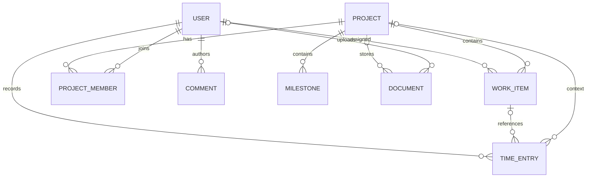

# DATABASE

> **Owner decision 2026-09-29:** ยกเลิก Customer model และใช้ `Company → Project.companyId` โดย Project เดิมโยงกับ Dhas ตาม [Company → Project decision](./COMPANY_PROJECT_DECISION.md). Customer target ด้านล่างเป็นประวัติข้อเสนอเดิม.

| รายการ | ค่า |
| --- | --- |
| Database | PostgreSQL 16 |
| ORM | Prisma 6 (`prisma/schema.prisma`) |
| สถานะ | #18 เพิ่ม Company relation และ Project.companyId nullable ใน source; ยังไม่ยืนยัน rollout จริงหรือ NOT NULL |
| ภาษาหลัก | ภาษาไทย; คงชื่อ model/field ตาม code |
| เอกสารเชื่อมโยง | [Shared Data Model](./SHARED_DATA_MODEL.md) · [Customer/Project Migration Contract](./CUSTOMER_PROJECT_MIGRATION.md) · [GitLab Issue Import Contract](./GITLAB_ISSUE_IMPORT.md) · [DATABASE_MAPPING.md](./DATABASE_MAPPING.md) · [API.md](./API.md) · [DEPLOYMENT.md](./DEPLOYMENT.md) |

> ส่วน As-Is อ้างอิง Prisma schema ใน repository ณ วันที่ 2026-09-27 ไม่ใช่ผล introspection ของ database instance ใดโดยเฉพาะ การเพิ่ม `Customer` และ constraint ในหัวข้อ Target ต้องผ่าน review, backup และ migration/backfill plan ก่อน deploy

## 1. Database conventions

- Prisma datasource ใช้ PostgreSQL ผ่าน `DATABASE_URL`; local/Docker environment สร้าง URL จาก root `.env` ผ่าน environment injection
- `id` ส่วนใหญ่เป็น String ใช้ `cuid()`; เวลาใช้ `DateTime` และ default `now()`; `updatedAt` ใช้ `@updatedAt`
- Target convention: วันที่และเวลาทุกค่าที่บันทึกลง PostgreSQL ใช้ `Asia/Bangkok`. Date-only fields แทนวันปฏิทิน Bangkok; timestamp fields แทน Bangkok local wall-clock date/time และห้าม normalize เป็น UTC. กำหนด timezone ของ application, PostgreSQL session และ database defaults เป็น `Asia/Bangkok`; application ต้อง parse/format ด้วย timezone นี้อย่างชัดเจน
- Target mapping: calendar-only fields ใช้ PostgreSQL `DATE` และ Prisma `@db.Date`; timestamps ใช้ `TIMESTAMP(3) WITHOUT TIME ZONE` และ Prisma `@db.Timestamp(3)` โดยค่าที่เขียนเป็น Bangkok local wall-clock. `DateTime` ที่ไม่มี native annotation ใน Prisma ปัจจุบัน default-map เป็น `timestamp(3)`; ให้ระบุ native type ชัดเจนใน target schema เพื่อป้องกันความหมายเปลี่ยน
- Prisma model จะ map ไป table ชื่อเดียวกันตาม default ยกเว้น `WorkItem` ซึ่ง map ไป table `work_items`
- Prisma field `WorkItem.types` map ไป PostgreSQL column `labels_types` และเป็น `String[]`
- ไม่มี schema migration folder ในรายการไฟล์ปัจจุบันที่ตรวจพบ; Docker migration service ใช้ guarded `prisma db push` ไม่ใช่ versioned migration history
- จำนวน/scale ของ `Decimal` ยังไม่ได้กำหนดใน schema สำหรับ `budget`, `spent` และ `hours`

## 2. As-Is models

### 2.1 `User` → `User` (As-Is schema)

| Field | Type / constraint | ความหมาย |
| --- | --- | --- |
| `id` | String, PK, cuid | รหัสผู้ใช้ |
| `email` | String, unique, index | อีเมล |
| `name` | String | ชื่อที่แสดง |
| `password` | String | credential field; schema ไม่บอก hashing/provider policy |
| `role` | String, default `member` | field legacy ใน schema; comment ระบุ member/manager/admin แต่ไม่ใช่ Developer/Infra/SA |
| `avatar`, `phone` | String? | รูป/เบอร์ติดต่อ |
| `status` | String, default `Active` | comment ระบุ Active/Inactive/Away |
| `joinDate` | DateTime, default now | วันที่เริ่มงาน |
| `createdAt`, `updatedAt` | DateTime | เวลาสร้าง/แก้ไข |

Relations: assigned Work Items, Project memberships, comments, activity logs, notifications, time entries, created projects, documents.

**Business target:** มีผู้ใช้ระบบเพียงคนเดียวคือเจ้าของโปรเจ็ค และมี `User` record ที่แทนเจ้าของหนึ่งคน ค่า `User.role` ปัจจุบันเป็น implementation เดิม ไม่ได้กำหนด functional role ของงาน; Developer/Infra/SA อยู่ใน `WorkItem.role` เท่านั้น ตารางและ relations ปัจจุบันยังรองรับหลาย User ในเชิง schema แต่ไม่ใช่ requirement ของ product scope

### 2.2 `Company` → `Company`

`id` (PK), `name` (required), `industry`, `email`, `phone`, `address`, `website`, `logo`, `description` (optional), `createdAt`, `updatedAt`. ไม่มี unique constraint ที่บังคับให้มีบริษัทเดียว; business target คือ company profile เดียวต่อ installation

### 2.3 `Project` → `Project`

| Field | Type / constraint | ความหมาย |
| --- | --- | --- |
| `id` | String, PK, cuid | รหัส Project |
| `name` | String | ชื่อ |
| `description` | String? | รายละเอียด |
| `status` | String, default `Planning`, indexed | Planning / In Progress / Review / Completed / On Hold (comment) |
| `priority` | String, default `Medium`, indexed | Low / Medium / High / Critical (comment) |
| `startDate`, `dueDate` | DateTime (As-Is); Target PostgreSQL `DATE` / Prisma `@db.Date` | วันเริ่มและกำหนดเสร็จในปฏิทิน `Asia/Bangkok` |
| `budget`, `spent` | Decimal?, `spent` default 0 | งบ/ยอดใช้; ไม่มี scale ระบุ |
| `progress` | Int, default 0 | ความคืบหน้า; comment ระบุช่วง 0–100 แต่ไม่มี DB check |
| `colorProject` | String? | สีแสดงผล |
| `creatorId` | String? FK → User.id | ผู้สร้าง; relation `ProjectCreator` |
| `createdAt`, `updatedAt` | DateTime | เวลาสร้าง/แก้ไข |

Relations: creator, `ProjectMember[]`, `WorkItem[]`, documents, milestones, activity logs, time entries. ไม่มี `customerId` ใน As-Is

### 2.4 `ProjectMember` → `ProjectMember`

`id` (PK), `role` (String, default `member`), `joinedAt`; `projectId` FK → Project และ `userId` FK → User, ทั้งคู่ required; unique (`projectId`, `userId`); index แยกทั้งสอง FK. การลบ Project/User cascade ลบ membership. เป็น legacy schema relation; ไม่ใช่ requirement สำหรับ team/multiple users ใน product ปัจจุบัน

### 2.5 `WorkItem` → `work_items`

| Field | Type / constraint | ความหมาย |
| --- | --- | --- |
| `id` | String, PK, cuid | รหัสงาน |
| `title` | String | ชื่องาน |
| `description` | String? | รายละเอียด |
| `kind` | Enum `WorkItemKind` | Incident / Issue / Task |
| `priority` | Enum `WorkItemPriority`, default `none` | none / low / medium / high / urgent |
| `role` | Enum `WorkItemRole`? | functional role ที่เจ้าของทำงานใน Work Item นี้: Developer / infra / SA; ไม่ใช่ account role/permission |
| `status` | Enum `WorkItemStatus`, default `backlog` | backlog, todo, in-progress, blocked, sa-testing, pm-testing, completed, cancelled |
| `types` | String[], default `[]`, column `labels_types` | labels/types |
| `workDate`, `dueDate` | DateTime? (As-Is); Target PostgreSQL `DATE` / Prisma `@db.Date` | วันทำงานและกำหนดเสร็จตามปฏิทิน `Asia/Bangkok` |
| `submittedAt` | DateTime?; Target PostgreSQL `TIMESTAMP(3) WITHOUT TIME ZONE` / Prisma `@db.Timestamp(3)` | เวลาเปลี่ยนสถานะตาม Bangkok local wall-clock; ปัจจุบัน stamp สำหรับ sa-testing/completed |
| `createdAt`, `updatedAt` | DateTime | เวลาสร้าง/แก้ไข |
| `projectId` | String, required FK → Project.id | Project เจ้าของงาน; delete Project cascade ลบ WorkItem |
| `assigneeId` | String, required FK → User.id | ผู้รับผิดชอบ; target คือ owner `User` record เดียว |

Indexes: projectId, assigneeId, kind, status, priority, workDate, dueDate, createdAt.

### 2.6 `TimeEntry` → `TimeEntry` (Daily Work)

| Field | Type / constraint | ความหมาย |
| --- | --- | --- |
| `id` | String, PK, cuid | รหัสบันทึกเวลา |
| `description`, `remarks` | String? | รายละเอียดและหมายเหตุ |
| `hours` | Decimal | ชั่วโมง; ไม่มี precision/scale/check ระบุ |
| `date` | DateTime, default now (As-Is); Target PostgreSQL `DATE` / Prisma `@db.Date` | วันที่บันทึกตามปฏิทิน `Asia/Bangkok` |
| `status` | String? | free-form; comment ระบุตัวอย่าง To Do/In Progress/Review/Completed/Blocked |
| `createdAt`, `updatedAt` | DateTime | เวลาสร้าง/แก้ไข |
| `userId` | String, required FK → User.id | ผู้บันทึก; delete User cascade ลบ TimeEntry |
| `projectId` | String? FK → Project.id | Project context; delete Project cascade ลบ TimeEntry |
| `workItemId` | String? FK → WorkItem.id | Work Item context; delete WorkItem เปลี่ยนเป็น null (`SetNull`) |

Indexes: userId, projectId, workItemId, date. API/หน้า Daily Work กำหนด Project และ Work Item เป็น required สำหรับการสร้าง แต่ database อนุญาตให้เป็น null และไม่บังคับว่า Project ของ TimeEntry ตรงกับ Project ของ WorkItem. Target มีผู้บันทึกเพียงเจ้าของระบบ

### 2.7 Models อื่นใน schema

| Model/table | Fields หลัก | ความสัมพันธ์/หมายเหตุ |
| --- | --- | --- |
| `Comment` | id, content, createdAt, updatedAt, authorId | ผูก User ผู้เขียน แต่ยังไม่มี relation ไป WorkItem/Project |
| `Milestone` | id, name, description, dueDate, status, timestamps, projectId | ผูก Project; status เป็น String |
| `Document` | id, name, description, fileUrl, fileSize, fileType, timestamps, projectId?, uploaderId? | ผูก Project/User แบบ optional |
| `ActivityLog` | id, action, entity, entityId, description, metadata JSON?, createdAt, userId?, projectId? | entity/entityId เป็น polymorphic string ไม่มี FK ไป entity จริง |
| `Notification` | id, title, message, type, read, link, createdAt, userId | ผูก User; type เป็น String |

## 3. Relationship summary As-Is



Customer relation ยังไม่มี ส่วน relation ระหว่าง TimeEntry กับ Project/WorkItem เป็น optional และไม่มี composite constraint ตรวจ consistency ของทั้งคู่

## 4. Target schema changes ที่เสนอ

### 4.1 เพิ่ม `Customer`

ข้อเสนอเริ่มต้น:

```text
Customer
  id          String PK (cuid)
  name        String required
  code        String? (optional; no uniqueness contract)
  status      CustomerStatus (active, inactive)
  email       String?
  phone       String?
  address     String?
  website     String?
  notes       String?
  createdAt   DateTime
  updatedAt   DateTime

Project.customerId String? FK → Customer.id (nullable ระหว่าง backfill)
```

```text
CustomerStatus = active | inactive
```

Required business cardinality: Customer 1:N Project; **Project แต่ละรายการต้องผูกกับ Customer หนึ่งราย** และ Customer หนึ่งรายผูก Projects ได้หลายรายการ ตาม [Shared Data Model](./SHARED_DATA_MODEL.md). ขั้นต่ำคือ stable `id`, ชื่อที่ไม่ว่าง, `status` (`active`/`inactive`) และ audit timestamps; contact fields เป็น optional. Customer ที่ Project ใช้อยู่ห้าม hard-delete ให้ deactivate; Project ที่มี work/history ห้าม hard-delete. ระหว่าง migration `customerId` nullable ได้เฉพาะ staged backfill ก่อน map ทุก Project จาก approved register และตรวจ orphan. ห้ามใช้ชื่อลูกค้าจาก seed/sample เป็นข้อเท็จจริงโดยไม่มีการยืนยัน. ขั้นตอนสำคัญและ recovery gate อยู่ใน [Customer/Project Migration Contract](./CUSTOMER_PROJECT_MIGRATION.md).

### 4.2 External reference สำหรับ GitLab Issues (target)

เพื่อ sync GitLab → PMS ซ้ำได้โดยไม่สร้าง WorkItem ซ้ำ ให้เพิ่มตารางเชื่อมภายนอกและ mapping GitLab Project กับ Project ใน PMS:

```text
GitLabProjectMapping
  id, canonicalGitLabInstanceUrl, gitLabProjectId, projectId FK → Project.id
  approvedLabelMap JSONB // exact GitLab label → supported WorkItem.types; owner-approved
  unique(canonicalGitLabInstanceUrl, gitLabProjectId)

ExternalWorkItemReference
  id, workItemId FK → WorkItem.id
  provider, canonicalGitLabInstanceUrl, gitLabProjectId, gitLabGlobalIssueId, gitLabIssueIid
  externalUrl, remoteUpdatedAt, lastSyncedAt, createdAt, updatedAt
  unique(provider, canonicalGitLabInstanceUrl, gitLabProjectId, gitLabGlobalIssueId)
  unique(workItemId) // ระยะแรก: WorkItem หนึ่งรายการผูกแหล่งภายนอกได้หนึ่งรายการ
```

ฟิลด์นี้เป็น target contract: identity คือ `(provider=gitlab, canonical instance URL, GitLab Project ID, global Issue ID)`. Normalize scheme/host และ trailing slash; preserve self-managed base path. `approvedLabelMap` เป็น JSONB ของ mapping ที่ owner ยืนยันและ validate target กับ supported `WorkItem.types` ทุกครั้ง. ใช้ global Issue ID เป็น deduplication key, เก็บ IID สำหรับ URL/diagnostics, และให้ unique constraint เป็น concurrent-upsert guard. `remoteUpdatedAt` เก็บ Bangkok local wall-clock source version เพื่อป้องกัน stale retry; `lastSyncedAt` ก็ใช้ Bangkok local wall-clock. GitLab token ห้ามเก็บในตารางนี้หรือส่งให้ client; ใช้ secret store/environment หรือ owner-scoped secret provider ที่เลือกแล้ว. รายละเอียด identity, transaction และ failure behavior อยู่ใน [Customer/Project Migration Contract](./CUSTOMER_PROJECT_MIGRATION.md) และ [GitLab Issue Import Contract](./GITLAB_ISSUE_IMPORT.md).

### 4.3 Data integrity ที่ควรประเมิน

- หากฐานข้อมูลมี User หลายแถวจาก seed/ข้อมูลเดิม ให้เลือก User row ที่เป็นเจ้าของหลักก่อน; map `WorkItem.assigneeId` และ `TimeEntry.userId` อย่างมี audit โดยไม่ลบประวัติหรือ user rows ก่อนตรวจ references ทั้งหมด
- บังคับว่า Daily Work ของ workflow นี้ต้องมี `workItemId`; หากรักษา optional เพื่อ legacy/import ให้ปฏิเสธ orphan records ในหน้าปฏิบัติงานและรายงานแยก
- Project ID ของ TimeEntry ควรถูก derive จาก WorkItem หรือใช้ composite relation/check เพื่อป้องกัน mismatch
- กำหนด precision ของ Decimal (`hours`, `budget`, `spent`); ชั่วโมงใช้ scale ที่เหมาะกับการบันทึกเศษชั่วโมงและ currency ใช้ scale 2 ตาม currency policy
- เพิ่ม check constraints สำหรับ `hours > 0`, `progress BETWEEN 0 AND 100` และ date ranges ตามกฎที่ตกลง
- พิจารณา enum/reference tables สำหรับ Project status/priority และ owner account status แทน String free-form; `TimeEntry.status` เป็น legacy field ไม่ใช่สถานะ workflow ของ Target และห้ามใช้แทน `WorkItem.status`; อย่านำ `Developer`/`Infra`/`SA` ไปใส่ `User.role`
- เพิ่ม `completedAt` หรือ `WorkItemStatusHistory` สำหรับ historical throughput; กำหนดการ stamp/reset เมื่อ status เข้า/ออก terminal state
- พิจารณา soft delete/archive สำหรับ Project/User/WorkItem เพื่อรักษา TimeEntry, ActivityLog และ audit history
- กำหนดวิธีบังคับ/เลือก company profile เดียวต่อ installation; multi-company/tenant model อยู่นอก scope ปัจจุบัน
- ปรับ relation ของ Comment/ActivityLog หากต้องการแสดง conversation/activity ต่อ WorkItem อย่าง referentially safe

## 5. Constraints, indexes และ referential actions

### As-Is ที่สำคัญ

- `User.email` unique; `ProjectMember(projectId,userId)` unique
- Foreign keys ใช้ relation Prisma ตาม schema; Project delete cascades WorkItems, ProjectMembers, Documents, Milestones, ActivityLogs, TimeEntries
- WorkItem delete ทำให้ TimeEntry.workItemId เป็น null; User delete cascade ลบ TimeEntries และ memberships/comments/notifications
- Indexes หลักอยู่บน filter fields ตามที่ระบุใน model sections; ไม่พบ composite index สำหรับ query แบบ project+status+date หรือ user+date

### Target review

เลือก composite indexes จาก query จริง เช่น `WorkItem(projectId,status)`, `WorkItem(role,status)`, `TimeEntry(date)`, `TimeEntry(workItemId,date)` และ `Project(customerId,status)` หลังดู `EXPLAIN ANALYZE` บนข้อมูลที่เป็นตัวแทน ไม่เพิ่ม index ทุก combination โดยไม่วัดผล

## 6. Schema change process

1. ทำตาม [Customer/Project Migration Contract](./CUSTOMER_PROJECT_MIGRATION.md): inventory และ approved mapping register → backup + isolated restore rehearsal → nullable additive rollout → backfill → validation gates → required constraint. หยุดเมื่อมี unresolved mapping/orphan.
2. สร้าง Prisma schema change และตรวจ generated SQL/data-loss warning
3. หากมี data transformation ให้ทำ staged backfill และรายงาน record ที่ map ไม่ได้
4. สำหรับ production พิจารณาเปลี่ยน `db push` เป็น versioned migration เมื่อทีมพร้อม; ปัจจุบัน repository ใช้ safe `db push`
5. deploy additive nullable field/table ก่อน; backfill; validate; แล้วค่อยเพิ่ม not-null/unique constraints
6. ตรวจ `/api/health`, row counts, API และเมนูที่พึ่ง field หลัง rollout

ขั้นตอนใช้งาน Compose/DB ที่มีอยู่ดูใน [DEPLOYMENT.md](./DEPLOYMENT.md) และ [document/process/db.md](./process/db.md)


## Runtime security ที่ implement ใน #15

สถานะเพิ่มเติม ณ 2026-09-28: Issue #17 ไม่เปลี่ยน schema หรือ records. Runtime ต้องพบ `User` หนึ่งแถวเพื่อใช้เป็น owner identity; `WorkItem.assigneeId`, `TimeEntry.userId` และ Project creator ของรายการใหม่ใช้ ID นี้จาก server. `User.password` เดิมไม่ใช่ credential ของ gate และไม่มี session table ใหม่. HTTP Basic อยู่ที่ gate; เก็บ secret ใน environment ตาม [Runtime Security](./RUNTIME_SECURITY.md).

## Database operations ที่ implement ใน #16

เครื่องมือ backup/isolated restore/staged validation/health และ retention อยู่ใน [Database Rollout](./DATABASE_ROLLOUT.md). ใช้ Asia/Bangkok และตรวจ exact history โดยไม่แปลง timestamp เป็น UTC. Customer/GitLab target schema และ business API ยังไม่ถูก deploy ในงาน Infra นี้. เจ้าของกำหนด defaults เป็น BACKUP_DIR=./database/backups/postgres_data และ BACKUP_KEEP_DAYS=30 แล้ว. ผล isolated verification ยืนยันการเตรียมเครื่องมือของ #16; ยังไม่ได้ rollout หรือสร้าง backup ของ Dev/UAT/Production จริง ซึ่งต้องผ่าน runbook ก่อน schema changes.
