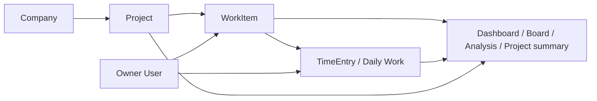

# DATABASE MAPPING

> **Owner decision 2026-09-29:** Mapping ที่ใช้ต่อจากนี้คือ `Company → Project → WorkItem → TimeEntry`; ไม่มี Customer. รายการ Customer ด้านล่างเป็นประวัติข้อเสนอเดิม ดู [Company → Project decision](./COMPANY_PROJECT_DECISION.md).

| รายการ | ค่า |
| --- | --- |
| วัตถุประสงค์ | เชื่อม Menu, UI field, API และ persistent model |
| สถานะ | As-Is mapping พร้อม Target mapping |
| ภาษา | ภาษาไทยเป็นหลัก; ชื่อ code/schema คงภาษาอังกฤษ |
| เอกสารเชื่อมโยง | [Shared Data Model](./SHARED_DATA_MODEL.md) · [Customer/Project Migration Contract](./CUSTOMER_PROJECT_MIGRATION.md) · [GitLab Issue Import Contract](./GITLAB_ISSUE_IMPORT.md) · [DATABASE.md](./DATABASE.md) · [API.md](./API.md) · [BUSINESS_REQUIREMENT.md](./BUSINESS_REQUIREMENT.md) |

> #18 เพิ่ม `Project.companyId` แบบ nullable พร้อม API/UI Company และ Projects ใน source แล้ว; ยังไม่ยืนยัน rollout จริงหรือ backfill ครบ. GitLab external references ยังเป็น target. สัญญาใหม่ยึด [Company → Project decision](./COMPANY_PROJECT_DECISION.md).

การ backfill, mapping register, validation/rollback gates และ external identity uniqueness ใช้ [Customer/Project Migration Contract](./CUSTOMER_PROJECT_MIGRATION.md) เป็นข้อกำหนดกลาง. GitLab fields, project mapping, upsert และ failure outcomes ใช้ [GitLab Issue Import Contract](./GITLAB_ISSUE_IMPORT.md). Register จริงเป็น run artifact ของ environment และห้ามใส่ข้อมูลลูกค้าจริงใน repository.

Target mapping: ค่า default time zone ของระบบ, application และ PostgreSQL session คือ `Asia/Bangkok` ทุก environment. Calendar-only fields ใช้ PostgreSQL `DATE` (Prisma `@db.Date`) และ timestamps ใช้ `TIMESTAMP WITHOUT TIME ZONE` (Prisma `@db.Timestamp`) เก็บค่า Bangkok local wall-clock; ห้ามแปลง timestamp เป็น UTC. ห้ามอาศัย timezone ของ browser/device ในการ map วัน.

## 1. Source-of-truth matrix

| Business data | Canonical model | Canonical key | อ่านโดย | เขียนโดย |
| --- | --- | --- | --- | --- |
| Work Item / status / assignment | `WorkItem` / `work_items` | `WorkItem.id` | Work Items, Board, Dashboard, Projects, Analysis, Daily Work selector | Work Items API; target Board mutation ผ่าน WorkItem service |
| Daily Work / actual hours | `TimeEntry` | `TimeEntry.id` | Daily Work, Work Item detail, Project, Dashboard, Analysis | Work Logs API (`/api/work-logs`) |
| Project | `Project` | `Project.id` | Projects, selectors, Work Items, Daily Work, Dashboard, Analysis | Projects page/API |
| Company / Project context | `Company` → `Project.companyId` | `Company.id` / `Project.id` | Company, Projects, Work Items, Dashboard, filters, Analysis | Company and Project APIs (#18); Work Items resolve Company through Project |
| Owner identity | One `User` row | `User.id` | Work Items (assignee), Daily Work (logger), Settings | Issue #17: server `getOwner()` หลัง owner gate/middleware; ไม่รับ browser ID ที่ต่างจาก owner |
| Work Item functional role | `WorkItem.role` | enum value | Work Items, Board, Analysis, Project summaries | Work Items API; values Developer / infra / SA |
| GitLab Issue identity | Implemented Prisma source `ExternalWorkItemReference` (#20); not rolled out | provider + canonical instance URL + GitLab project ID + global issue ID | Work Items (source link/sync result) | Unique key plus per-Issue transactional upsert; schema apply requires environment rollout approval |
| GitLab Project link | Target `GitLabProjectMapping` | GitLab instance/project ID → `Project.id`; owner-approved `approvedLabelMap` | Work Items sync setup; Project supplies Customer context | Owner-managed mapping; one GitLab Project maps to one PMS Project in phase one |
| Company profile | `Company` | `Company.id` | Company, Projects, Work Item detail | Company API (#18) |
| Project membership | Legacy `ProjectMember` relation | `ProjectMember.id` | As-Is Projects/Company counts only | No multi-member/team management in target scope |
| Owner profile/preferences | `User.name`, `email`, `phone`, `avatar`, `theme`, `locale` | `User.id` จาก `getOwner()` | Settings และ shared ThemeProvider | `GET/PATCH /api/settings/me` (#25); ไม่มี timezone override, password/2FA หรือ unintegrated notifications |

## 2. Menu-to-data mapping

| Menu / page | As-Is source | Fields/relations ที่ใช้หรือแสดง | Target mapping / missing |
| --- | --- | --- | --- |
| Dashboard `/` | shared Prisma query `lib/dashboard.ts`; page and `/api/dashboard/summary` | `WorkItem`, `TimeEntry`, `Project`, `Company` relations | #23 aggregates owner WorkItems and exact TimeEntry hours; date anchor and Bangkok grouping; Company/Project/role/kind filters; recent Project progress uses shared formula; links retain active filters |
| Projects `/projects` | Prisma `Project.findMany`; counts WorkItems/Members; detail uses Project API | Project status/priority/date/budget/spent/progress; `_count.workItems`, legacy `_count.members`; WorkItem status summary | Add required Project.customer relation; hours = `SUM(TimeEntry.hours)`; one shared progress formula; summarize WorkItem functional roles, not team members |
| Work Items `/work-items` | `/api/work-items`, `/api/projects?options=work-items`, `/api/users`; proposed `/api/integrations/gitlab/*` | `WorkItem` core fields; nested Project/Company; GitLab source reference | #19 validates shared CRUD/import, filters Company/status/priority/role, shows owner Daily Work; GitLab sync remains a separate target |
| Board `/board` | `GET /api/work-items` paginated collection; Company/Project options from their APIs | `WorkItem.id`, title, description, kind, priority, role, status, dates, Project and Company relation | Status enum defines columns; filters use shared API; mutation uses `PATCH /api/work-items/{id}`; no Board-specific storage |
| Analysis `/analysis` | `GET /api/analysis/summary` → `lib/analysis.ts` | `WorkItem`, `TimeEntry`, `Project`, `Company`; filtered source IDs | #24 shares Dashboard parser/where/formulas; returns status/kind/priority breakdown, exact Bangkok-grouped hours, filtered rows and source links/export; no throughput history |
| Daily Work `/daily-work` | `/api/work-logs`; API persists to `TimeEntry` | `TimeEntry.date/hours/description/remarks/status/userId/projectId/workItemId`; nested User, Project, WorkItem | Derive `projectId` from WorkItem or enforce equality; resolve the sole owner identity server-side; summary uses exact rows |
| Company `/company` | server Prisma query on `Company`, `User`, `Project`, `WorkItem` | company first row/fallback display; current User/team counts and memberships are legacy UI/schema | Implement Company profile and Customer registry persistence; show Customer → Projects → Work Items/hours; remove member/team administration |
| Settings `/settings` | `GET/PATCH /api/settings/me` + `User` | `name`, `email`, `phone`, `avatar`, `theme`, `locale`; timezone มาจาก system config | #25 persist owner-scoped profile/preferences; ThemeProvider and header use saved theme; HTML `lang` follows locale; Bangkok timezone is read-only |

## 3. Field-level mapping

### Work Items UI/API → `WorkItem`

| UI / API property | Prisma field | Transformation / rule |
| --- | --- | --- |
| `id` | `id` | cuid string |
| `title`, `description` | same | title required; description optional |
| `kind` | `kind` | `Incident` / `Issue` / `Task` enum |
| `priority` | `priority` | none/low/medium/high/urgent enum |
| `role` | `role` | Work Item functional role: Developer/infra/SA or null; not an account role |
| `status` | `status` | API serializes `in_progress` ↔ `in-progress`, `sa_testing` ↔ `sa-testing`, `pm_testing` ↔ `pm-testing` |
| `types` | `types` → DB `labels_types` | String array validated against supported types |
| `workDate`, `dueDate` | same | PostgreSQL `DATE` / Prisma `@db.Date`; persist and compare as calendar dates in `Asia/Bangkok` |
| `submittedAt` | same | `TIMESTAMP WITHOUT TIME ZONE` / Prisma `@db.Timestamp(3)`; Bangkok local wall-clock; currently stamp for `sa-testing` and `completed`, not an unambiguous completedAt |
| `projectId` | `projectId` | required FK; relation supplies Project label/color |
| `assigneeId` | `assigneeId` | required FK; target resolves to the sole owner User row |

### GitLab Issue → `WorkItem` (target, inbound only)

| GitLab field | PMS target | Transformation / rule |
| --- | --- | --- |
| GitLab Project ID | `GitLabProjectMapping` → `Project.id` | ต้อง map ก่อน sync; Customer มาจาก Project ใน PMS |
| global Issue ID, project ID, instance URL, web URL | `ExternalWorkItemReference` | เก็บ identity/URL; unique key ใช้ป้องกันรายการซ้ำ |
| `title`, `description` | `WorkItem.title`, `WorkItem.description` | ฟิลด์จากต้นทาง; sync ซ้ำอัปเดตตาม GitLab |
| GitLab Issue | `WorkItem.kind` | กำหนดเป็น `Issue`; assignee เป็น owner คนเดียว, priority เป็น `none`, `role` และ `workDate` ว่างเมื่อสร้างใหม่ |
| `state` | `WorkItem.status` | `opened → todo`, `closed → completed`; ไม่มี status ใหม่ |
| `labels` | `WorkItem.types` | ใช้ `GitLabProjectMapping.approvedLabelMap` แบบ exact/case-sensitive ไปยังค่าที่รองรับ (`bug`, `data`, `documentation`, `epic`, `feature`, `maintenance`, `opl`, `ops`, `support`, `task`); แทนที่ชุด mapped ทุกครั้ง; label ที่ไม่ map ถูกข้ามและรายงาน; ห้ามกำหนด `role` จาก label |
| `due_date` | `WorkItem.dueDate` | date-only `YYYY-MM-DD` เป็น Bangkok calendar date; null ล้างค่าเดิม; ไม่เปลี่ยนวันตาม timezone |
| remote `updated_at` | `ExternalWorkItemReference.remoteUpdatedAt` | เก็บ remote source version เป็น Bangkok local wall-clock; ใช้ป้องกัน stale retry; ไม่เขียนทับ `WorkItem.updatedAt` |
| GitLab assignee | — | ระบบมี owner คนเดียว; ไม่สร้าง User/assignee จาก GitLab |

การ sync ไม่เขียนกลับ GitLab; Issue ที่มี reference ใช้ identity เดิม ส่วน Issue ใหม่สร้าง `kind=Issue`, owner assignee, `priority=none`, `role=null`, `workDate=null`. ทุกครั้งให้ GitLab เป็นเจ้าของ title/description/status/mapped types/dueDate ส่วน `role`, `priority`, `workDate`, owner และ `TimeEntry` เป็นของ PMS. Exact identity, initial reconciliation, pagination, retries และ partial outcomes อยู่ใน [GitLab Issue Import Contract](./GITLAB_ISSUE_IMPORT.md).

### Daily Work UI/API → `TimeEntry`

| UI / API property | Prisma field | Rule |
| --- | --- | --- |
| `id` | `id` | response identity |
| `description`, `remarks` | same | optional in schema; current page requires description on submit |
| `hours` | `hours` `Decimal(65,30)` | Server accepts only finite positive values that fit the database precision/scale and passes a normalized decimal string to Prisma; all summaries use exact decimal addition |
| `date` | `date` | Target PostgreSQL `DATE` / Prisma `@db.Date`; calendar date in `Asia/Bangkok`; day boundaries use the same timezone |
| `TimeEntry.status` | `status` | optional free-form legacy field As-Is; not a WorkItem workflow status or target metric; do not create a second status vocabulary |
| `userId` | `userId` | current page selects Admin/default User client-side; target always resolve the single owner's authenticated identity server-side |
| `projectId` | `projectId` | Project context มาจาก Project ของ WorkItem; derive หรือ validate ให้ตรงกันทุกครั้งที่ส่งค่านี้ |
| `workItemId` | `workItemId` | required in the target model; each TimeEntry belongs to exactly one WorkItem |
| nested `workItem` | relation | response includes id/title/kind/status; status serialized to public enum spelling |

### Project summary

| Display value | Source/formula |
| --- | --- |
| Work Item total | count of `WorkItem` where `projectId = Project.id` |
| Completed | count where status = `completed` |
| Open | count where status not in `completed`, `cancelled` |
| Progress (target) | completed ÷ (total − cancelled) × 100; zero denominator → 0 |
| Members | As-Is count `ProjectMember` rows; not a target product metric under the single-owner requirement |
| Logged hours (target) | sum `TimeEntry.hours` grouped by `projectId` or joined through WorkItem; ensure no duplicated join rows |
| Customer (target) | `Project.customerId → Customer.id`; no current field |

## 4. Integrity matrix

| Rule | Current enforcement | Target enforcement |
| --- | --- | --- |
| Work Item references valid Project | Required FK; API checks project exists | Keep FK and validate permissions |
| Work Item references valid assignee | Required FK; create API checks user exists | Resolve to the sole owner User row; remove assignee choice among multiple users |
| Daily Work references valid user | Required FK; POST API checks user exists | Use the sole owner's authenticated identity; retain FK |
| Daily Work Project and Work Item match | #21 POST/PATCH validate an owner-owned WorkItem on every mutation and derive `projectId`; supplied mismatch returns 400. DB does not enforce the pair and nullable legacy relations remain | Keep the API invariant; consider a database pair constraint only after legacy rows are audited and mapped |
| Work Item/TimeEntry enum validity | WorkItem enums and API parser; TimeEntry.status is free-form String | Keep WorkItem status canonical; TimeEntry has no separate target workflow status |
| Project has Company | Required `Project.companyId` FK; API checks selected Company | Keep Company FK and validate selection |
| Company registry | Company API and owner UI (#18); Project selects Company | Multiple Companies; Project selects one; existing Projects backfill to Dhas |
| Historical completion time | `submittedAt` means sa-testing or completed | Add `completedAt` or status history for period analytics |
| Owner identity on mutation | No session/auth enforcement found | Require authenticated owner; no manager/admin hierarchy under current scope |

## 5. Data lineage for shared views

Project/Company labels are context from relations, not copied text fields on WorkItem or TimeEntry. Keep stable IDs for joins; serialize display names for UI only. Developer/Infra/SA belong to `WorkItem.role`; they do not create separate User rows or access permissions.

## Work Item mapping ที่ implement ใน #19

`POST /api/work-items`, `PATCH /api/work-items/{id}` และ import ใช้ `lib/work-item-input.ts`; update/import ไม่ข้าม enum, Bangkok date, owner หรือ Project validation. `GET /api/work-items` รองรับ `companyId`, `kind`, `status`, `priority`, `role`, `projectId`, `year`, `month` และ search; เมื่อไม่ส่ง year ใช้ปีปัจจุบันตาม `Asia/Bangkok`. JSON export ใช้ field shape ที่ import รับได้. Detail serialize Project/Company และ TimeEntries ของ owner พร้อม date-only `YYYY-MM-DD` และ timestamp `+07:00`. การลบที่มี TimeEntry ถูกปฏิเสธ และ FK ใช้ `Restrict`. Schema ยังต้องผ่าน database rollout ก่อน deploy environment.

## Board mapping ที่ implement ใน #22

แต่ละการ์ดมาจาก `WorkItem.id` และอยู่ในคอลัมน์ตาม `WorkItem.status`; การกรอง Company อ่าน `Project.companyId`, Project ใช้ `WorkItem.projectId` และบทบาทใช้ `WorkItem.role`. Status mutation เรียก `PATCH /api/work-items/{id}` ผ่าน validation ชุดเดิม. ไม่มี Board record หรือ status copy เพิ่ม.

## Dashboard mapping ที่ implement ใน #23

`total/open/completed/overdue` อ่าน `WorkItem` ของ owner ตาม date anchor และ active filters; logged hours/series ใช้ `TimeEntry.userId/date/hours` แล้ว serialize exact Decimal values. Company แสดงผ่าน `Project.company`; Dashboard Work Item rows serialize canonical WorkItem/Project/Company IDs. Recent Project progress group-by `Project.id` และ current WorkItem status, แล้วเรียก shared `completionRate(total, completed, cancelled)`. KPI/list links ส่ง date, Company, Project, role/kind เดิมต่อไปยัง Work Items/Daily Work APIs. Aggregate fields ไม่ถูก persist.

## GitLab Issue mapping ที่ implement ใน #20

`GitLabProjectMapping` ชี้ `Project` ด้วย FK `Restrict`, เก็บ canonical server instance URL, numeric GitLab Project ID, exact approved label map และ nullable `firstSyncApprovedAt`. `ExternalWorkItemReference` เก็บ global identity, Project ID, IID, source URL, remote created/updated timestamps, `lastSyncedAt` และ unique `workItemId`; ไม่มี FK ไป mapping เพื่อให้ unmap รักษาประวัติ. All timestamp columns use `TIMESTAMP(3) WITHOUT TIME ZONE` / Prisma `@db.Timestamp(3)` and Bangkok local wall-clock values; `WorkItem.dueDate` remains PostgreSQL `DATE`. Schema source ยังไม่ได้ apply กับ Dev/UAT/Production; ต้องผ่าน verified backup, isolated restore และ `DB_SCHEMA_SYNC_APPROVED=true` ก่อน deploy. Gate คำนวณ fingerprint เองและบันทึกที่ `database/rollout/schema-approval.json`.

## Runtime security ที่ implement ใน #15

ณ #15 (2026-09-28) มี private owner access gate, server-only environment injection จาก root `.env`, loopback host ports และ `Asia/Bangkok` สำหรับ app/PostgreSQL session. #20 เพิ่ม GitLab connector ใน code; ไม่มีการเปิดเผย credentials หรือยืนยันการ deploy/เชื่อม instance จริง. รายละเอียดอยู่ใน [Runtime Security](./RUNTIME_SECURITY.md).

## Database operations ที่ implement ใน #16

เครื่องมือ backup/isolated restore/staged validation/health และ retention อยู่ใน [Database Rollout](./DATABASE_ROLLOUT.md). Issue #20 เพิ่ม schema source และ API implementation; ไม่มีการเปลี่ยนฐานข้อมูลจริงหรือการเรียก GitLab จริง. ใช้ verified rollout gates ของ target environment ก่อนเปิดใช้งาน.
