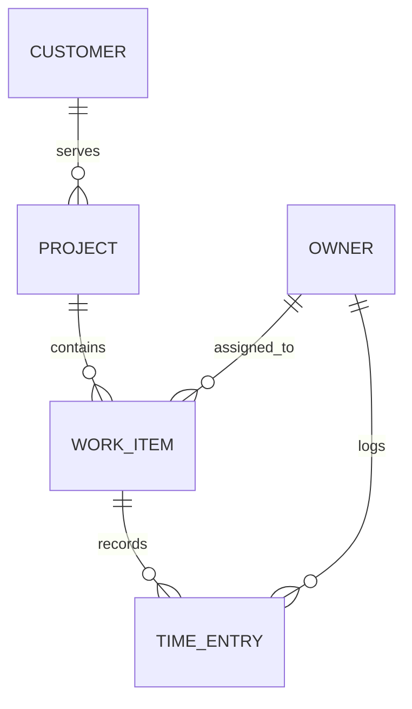

# Shared Work and Customer Data Model

> **Superseded for the Customer relation on 2026-09-29:** The owner chose Company Dhas → Project. WorkItem, TimeEntry, owner, status, metric, and Bangkok date rules below still apply. The current parent relation is in [Company → Project decision](./COMPANY_PROJECT_DECISION.md).

| รายการ | ค่า |
| --- | --- |
| Issue | #11 — Define the Shared Work and Customer Data Model |
| Role | SA |
| สถานะ | Target business data contract; ยังไม่ใช่การยืนยัน schema หรือ migration ที่ deploy แล้ว |
| เอกสารที่เกี่ยวข้อง | [Engineering Spec](./ENGINEERING_SPEC.md) · [Customer/Project Migration Contract](./CUSTOMER_PROJECT_MIGRATION.md) · [Business Requirement](./BUSINESS_REQUIREMENT.md) · [Database](./DATABASE.md) · [Database Mapping](./DATABASE_MAPPING.md) · [API](./API.md) |

เอกสารนี้เป็นสัญญากลางของข้อมูล Customer, Project, WorkItem, TimeEntry และเจ้าของระบบ ใช้ร่วมกันทุกเมนูและเป็นแหล่งอ้างอิงเมื่อคำอธิบายซ้ำในเอกสารอื่นไม่ตรงกัน ข้อเท็จจริง As-Is อ้างอิง Prisma schema และ API ใน repository; Target คือข้อกำหนดทางธุรกิจ ยังไม่ได้เพิ่ม Customer model หรือเปลี่ยน schema ใน issue นี้

## 1. As-Is และ Target

| หัวข้อ | As-Is ที่ตรวจพบ | Target contract |
| --- | --- | --- |
| Customer | ยังไม่มี Customer model หรือ Project.customerId ใน Prisma | Customer เป็น master data; ทุก Project มี Customer หลักหนึ่งราย |
| Project | Project มี WorkItems; ไม่มี Customer relation | Project มี Customer หนึ่งราย และมี WorkItems ได้หลายรายการ |
| WorkItem | ใช้ model WorkItem/table work_items, มี projectId และ assigneeId ที่ required | เป็น record หลักของงานและสถานะ; เมนูงานทุกหน้าชี้ WorkItem.id เดียวกัน |
| TimeEntry | hours เป็น Decimal; userId required; projectId และ workItemId nullable ใน schema; API บังคับคู่ Project/WorkItem ใน create แต่ PATCH ที่เปลี่ยน projectId อย่างเดียวอาจทำให้ไม่ตรงกัน | Daily Work เป็น TimeEntry ที่ต้องอ้าง WorkItem หนึ่งรายการ; Project ได้จาก WorkItem; ทุก mutation ต้องตรวจความสอดคล้อง |
| TimeEntry.status | String? แบบ free-form ใน schema และหน้า/API เดิมส่งค่าได้ | เป็น legacy field ไม่ใช่สถานะของงาน; ห้ามใช้แทน WorkItem.status หรือสร้าง workflow status แยกใน Daily Work |
| Owner | Schema รองรับหลาย User และไม่มี auth enforcement ที่พบ | มีเจ้าของจริงหนึ่งคน; server resolve User.id เดียวกันเป็น WorkItem assignee และ TimeEntry logger |
| Functional role | WorkItem.role เป็น enum ที่เลือกได้ | Developer, infra และ SA เป็นบทบาทการทำงานบน WorkItem เท่านั้น ไม่ใช่ User, permission, team หรือ account role |

การ backfill Customer, เลือกหรือรวม User เดิม, เปลี่ยน nullability, referential actions และข้อกำหนด migration เป็นงานแยกตาม issue ที่เกี่ยวข้อง ต้องไม่อนุมานค่าลูกค้าหรือเจ้าของจาก seed/sample data

สำหรับ Customer/Project migration ให้ใช้ [Customer/Project Migration Contract](./CUSTOMER_PROJECT_MIGRATION.md): Customer ขั้นต่ำมี stable ID, required name, `active`/`inactive` status และ audit timestamps; การ map ทุก Project ต้องมี approved evidence register. GitLab Issue identity ใช้ `(provider, canonical instance URL, GitLab Project ID, global Issue ID)` และ unique constraint ป้องกัน external reference ซ้ำ. เอกสารนี้กำหนด semantics; ไม่ได้ยืนยันว่า schema หรือข้อมูลจริงถูก migrate แล้ว.

## 2. Logical entities and relationships

| Entity | Identity and responsibility | Target cardinality / rule |
| --- | --- | --- |
| Customer | Customer.id, name required; ข้อมูล master ของลูกค้า | Customer มี Projects ได้ 0..หลายรายการ; Project หนึ่งรายการมี Customer หลักหนึ่งรายพอดี |
| Project | Project.id, name, target customerId; ขอบเขตงานและความสัมพันธ์ Customer | มี Customer หนึ่งรายและ WorkItems ได้ 0..หลายรายการ; Customer name มาจาก relation ไม่คัดลอกลง WorkItem/TimeEntry |
| WorkItem | WorkItem.id, projectId, assigneeId; title, kind, types, priority, role, status, workDate และ dueDate | WorkItem หนึ่งรายการอยู่ใน Project เดียวและมี owner หนึ่งคน; มี TimeEntries ได้ 0..หลายรายการ |
| TimeEntry | TimeEntry.id, workItemId, userId, date, hours; รายละเอียดและชั่วโมงจริง | TimeEntry หนึ่งรายการอ้าง WorkItem เดียวและ owner หนึ่งคน; Project เป็นบริบทของ WorkItem ไม่ใช่ Project อิสระ |
| Owner | User.id ของผู้ใช้จริงคนเดียว | เป็น assignee ของ WorkItem และผู้บันทึก TimeEntry; server เป็นผู้ resolve identity |
| Company | Company.id; profile ของบริษัทเจ้าของ installation | เป็นข้อมูลคนละส่วนกับ Customer; เป้าหมายมี Company profile เดียวต่อ installation และไม่อยู่บนสาย Customer → Project |

Project แต่ละรายการต้องมี Customer ใน Target; customerId จะ nullable ได้เฉพาะช่วง staged backfill ที่วางแผนและตรวจสอบแล้ว สำหรับ TimeEntry ให้ derive projectId จาก WorkItem; หาก API หรือ schema คง projectId ไว้เพื่อ compatibility/context ค่านั้นต้องเท่ากับ WorkItem.projectId ทุกครั้ง ห้ามเป็นความจริงชุดที่สอง

ใน schema ปัจจุบัน ProjectMember เป็น legacy relation เท่านั้น ไม่ใช่สมาชิกทีมใน product target และไม่สร้าง requirement สำหรับหลาย User, invitations, team permissions หรือ role matrix

## 3. Canonical enums and field ownership

| Field | Target values / owner | Meaning |
| --- | --- | --- |
| WorkItem.kind | Incident, Issue, Task | ชนิดของ WorkItem เดียวกัน ไม่ใช่คนละ entity/menu source |
| WorkItem.priority | none, low, medium, high, urgent | ความสำคัญของ WorkItem |
| WorkItem.role | Developer, infra, SA หรือ null | functional role ที่เจ้าของใช้ทำ WorkItem นี้ |
| WorkItem.status | backlog, todo, in-progress, blocked, sa-testing, pm-testing, completed, cancelled | สถานะเดียวของ WorkItem ที่ Work Items และ Board ใช้ร่วมกัน |
| TimeEntry.hours | Decimal ที่เป็นบวก | ชั่วโมงจริง; รวมค่า Decimal ก่อน format/round สำหรับแสดงผล |

Public API ใช้ in-progress, sa-testing และ pm-testing; Prisma map ค่าที่เกี่ยวข้องเป็น in_progress, sa_testing และ pm_testing ตาม schema ปัจจุบัน. TimeEntry ไม่ได้เป็นเจ้าของ WorkItem status และ submittedAt ไม่ใช่ completedAt.

## 4. Shared records across menus

| Menu | Reads / writes against the canonical records |
| --- | --- |
| Dashboard | อ่าน WorkItem และ TimeEntry aggregates; ลิงก์กลับด้วย WorkItem.id หรือ TimeEntry.id |
| Projects | อ่าน/แก้ Project และ Customer relations; สรุป WorkItem/TimeEntry records ชุดเดียวกัน |
| Work Items | สร้าง/แก้ WorkItem; แสดง TimeEntries ที่มี WorkItem.id เดียวกัน |
| Board | อ่านและเปลี่ยน WorkItem.status ของ WorkItem.id เดียวกันกับ Work Items |
| Analysis | aggregate WorkItem และ TimeEntry ชุดเดียวกัน; drill-through ใช้ source IDs |
| Daily Work | สร้าง/แก้/ลบ TimeEntry; WorkItem ID และ Project context ต้องสัมพันธ์กัน |
| Company | แก้ Company profile และ Customer registry; summary อ่าน Projects/WorkItems/TimeEntries จริง |
| Settings | เก็บ preference ของ owner; ไม่มี WorkItem หรือ TimeEntry source แยก |

ทุก endpoint, link, filter, summary และ drill-through ที่แทน record ต้องรักษา WorkItem.id หรือ TimeEntry.id เดิมไว้ การ์ด, chart point และหน้า detail เป็น projection ไม่ใช่ record สำเนาหรือสถานะที่แก้แยกได้

## 5. Shared metric, date, and hour definitions

นิยามด้านล่างใช้กับทุก Dashboard, Projects, Work Items, Board และ Analysis view ที่แสดง metric เดียวกัน:

| Metric | Definition |
| --- | --- |
| Total | จำนวน WorkItems ที่ตรง filters ทุก status รวม completed และ cancelled |
| Cancelled | จำนวน WorkItems ที่ status = cancelled |
| Completed | จำนวน WorkItems ที่ status = completed เท่านั้น; ไม่รวม cancelled |
| Open | จำนวน WorkItems ที่ status ไม่ใช่ completed และไม่ใช่ cancelled |
| Completion rate / Project progress | completed ÷ (total − cancelled) × 100; ถ้าตัวหารเป็น 0 ให้คืน 0% |
| Overdue | dueDate มี business calendar date ก่อนวันนี้ใน Asia/Bangkok และ status ไม่ใช่ completed/cancelled |
| Logged hours | SUM(TimeEntry.hours) ของ TimeEntries ใน date range และ filters; รวม Decimal โดยไม่ปัดก่อน summation |

ข้อกำหนดวันที่และการกรอง:

- ค่า default time zone ของระบบทุก environment คือ `Asia/Bangkok` สำหรับ UI calendar, date-only input, วันธุรกิจ, วันที่ครบกำหนด และการจัดกลุ่ม/กรองวัน.
- บันทึกทุก date/time ด้วย `Asia/Bangkok` semantics: date-only values เป็นวันปฏิทิน Bangkok; timestamp values เป็น Bangkok local wall-clock. ห้ามแปลงค่าที่เก็บเป็น UTC.
- ตั้ง timezone ของ application และ PostgreSQL session เป็น `Asia/Bangkok`; อ่าน/เขียนผ่าน API ด้วยการ parse/format timezone นี้อย่างชัดเจน ไม่ใช้ timezone ของ browser/device.
- ช่วงวันธุรกิจเริ่ม 00:00 Asia/Bangkok และสิ้นสุดก่อน 00:00 ของวันถัดไป; query ใช้ขอบเขตเดียวกันใน timezone Bangkok.
- Logged hours จัดกลุ่มและกรองจาก TimeEntry.date; role, kind, status, Project และ Customer ที่กรองชั่วโมงต้อง resolve ผ่าน WorkItem → Project → Customer ตาม relation เดียวกัน.
- Project progress/counts กรอง WorkItems ด้วย Project เดียว; ชั่วโมง Project รวม TimeEntries ผ่าน WorkItem ของ Project นั้นหนึ่งครั้งต่อ TimeEntry เพื่อไม่ให้ join ทำชั่วโมงซ้ำ.
- ปัดเศษได้เฉพาะรูปแบบแสดงผลหลัง aggregate โดยไม่เปลี่ยนค่าที่จัดเก็บหรือผลรวม; ไม่กำหนด precision/scale ใหม่ใน issue นี้.
- ห้ามรายงาน historical throughput จาก current status; ต้องมี status history หรือ timestamp ที่นิยามชัด เช่น completedAt ก่อน.

กลุ่ม UI “Complete” ใน Work Items อาจรวม completed และ cancelled เพื่อจัดกลุ่ม แต่ metric Completed ยังคงนับเฉพาะ completed.

## 6. Write and integrity rules

1. ทุก WorkItem อ้าง Project ที่มีอยู่ และ assignee คือ owner ที่ server resolve; client ไม่สามารถเลือก User อื่น.
2. ทุก Target TimeEntry มี WorkItem ที่มีอยู่และ owner ที่ server resolve; `hours` ต้องเป็น Decimal ที่ถูกต้องและมากกว่า 0.
3. Project context ของ TimeEntry มาจาก WorkItem; ถ้าส่ง projectId มาด้วย backend ตรวจคู่ Project/WorkItem ใน create และ update ทุกครั้ง และปฏิเสธ mismatch โดยไม่เขียนข้อมูล.
4. Customer, Project, WorkItem, TimeEntry และ owner labels มาจาก foreign-key relations; ห้ามคัดลอกชื่อลูกค้าหรือ Project เป็น source of truth บน child row.
5. Mutation ที่ลบหรือยกเลิก mapping ต้องไม่ลบ WorkItems/TimeEntries หรือประวัติธุรกิจโดยไม่ตั้งใจ; referential action/retention ปัจจุบันและแผน rollout ระบุแยกใน Database/Deployment.

## 7. Out of scope and follow-up boundaries

- ไม่มี requirement สำหรับหลายผู้ใช้, การจัดการทีม, ProjectMember admin, invitations, owner switching หรือ RBAC.
- ไม่เพิ่ม model ของ Task หรือ Issue แยกจาก WorkItem; kind Incident/Issue/Task อยู่บน WorkItem.
- ไม่กำหนด workflow status ของ TimeEntry; status free-form ที่มีอยู่เป็น As-Is legacy และไม่ใช้คำนวณ metric.
- Issue #11 กำหนด logical model และ semantics; Customer backfill/migration, owner access implementation, CRUD/API implementation และ schema rollout อยู่ที่ issues ที่ระบุใน checklist.
